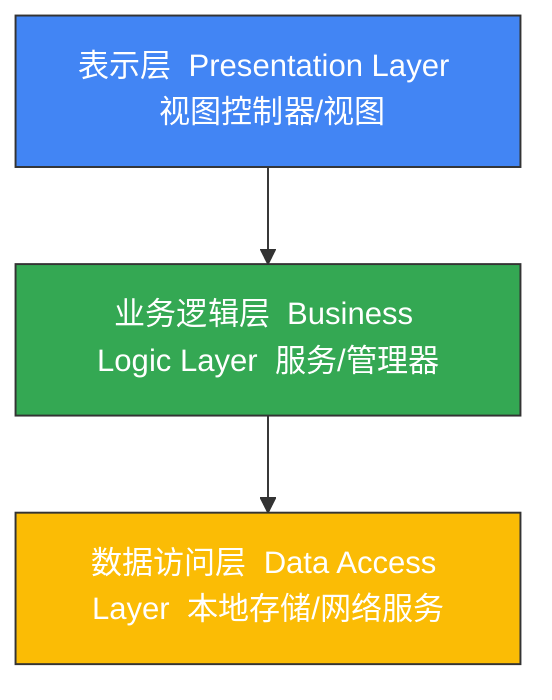
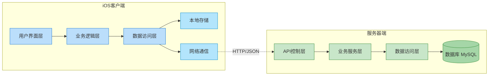
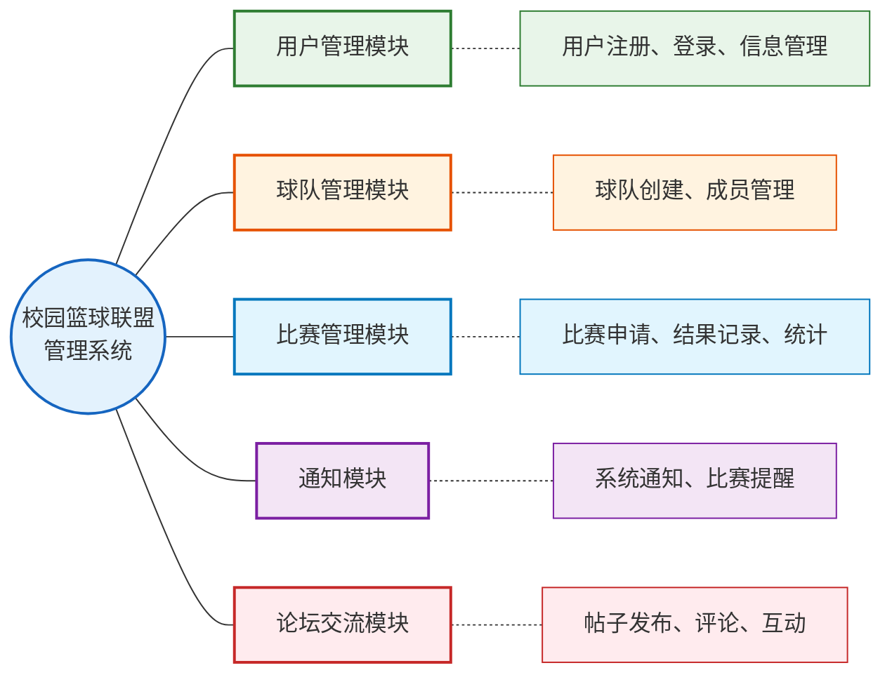
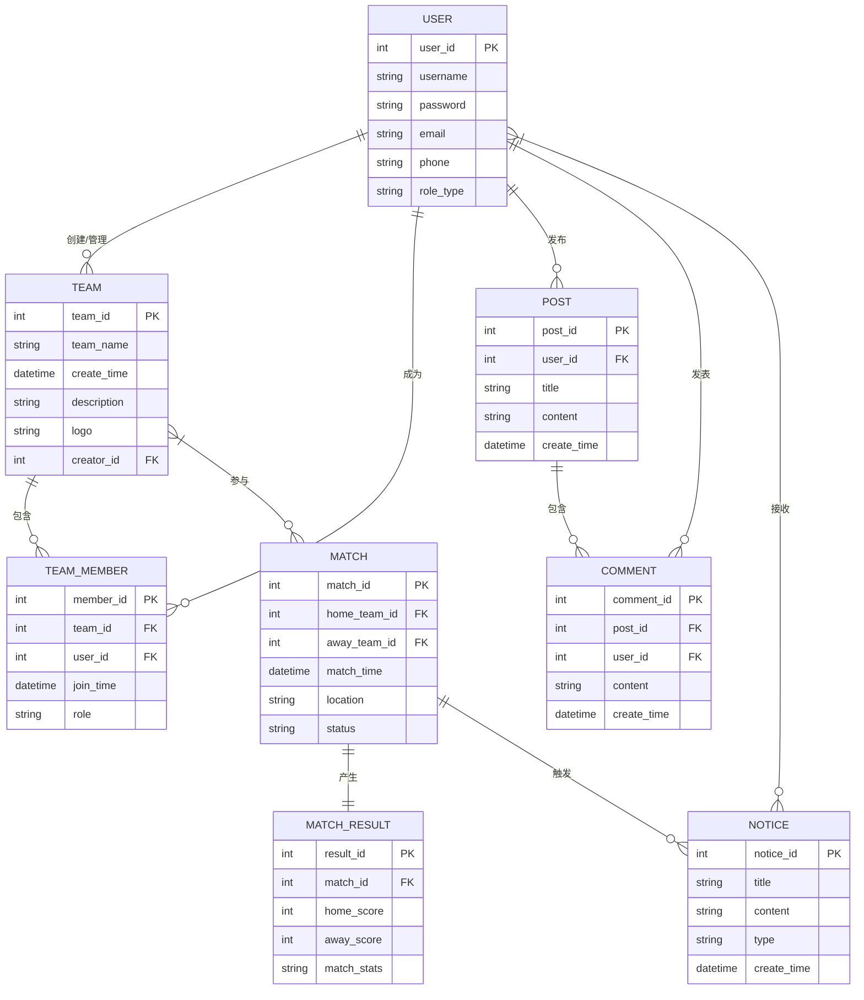
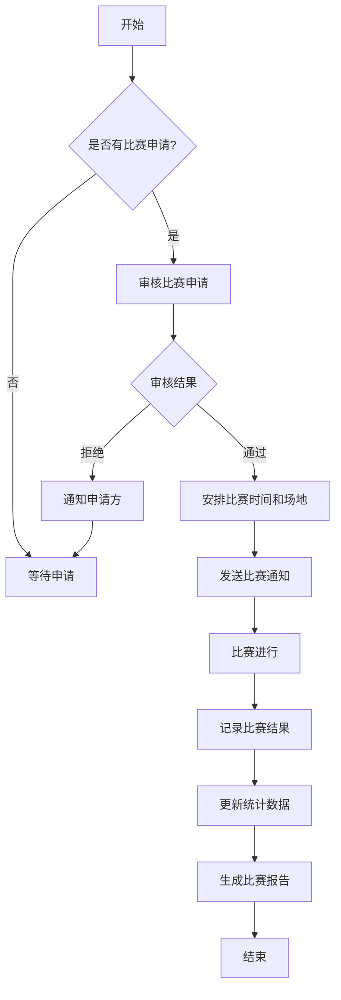
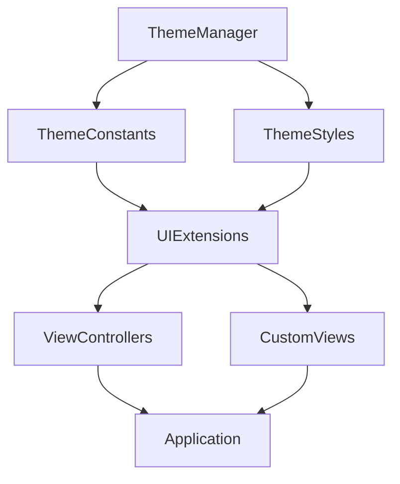
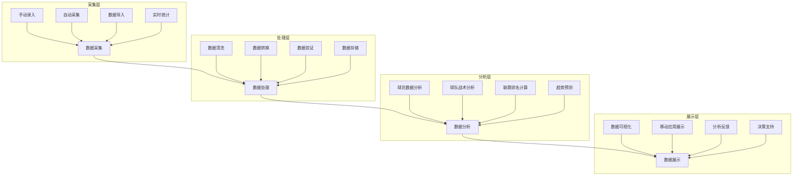
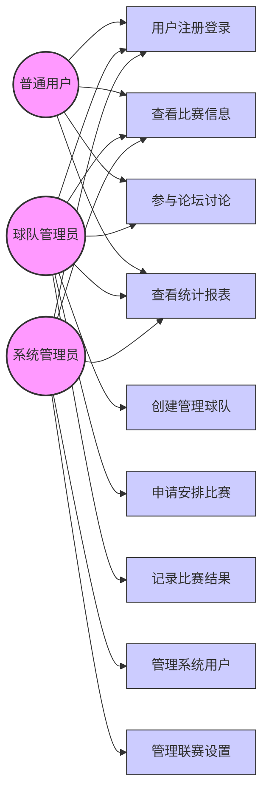

# 篮球联盟管理系统 - Mermaid图表

## 1. 系统分层架构图

系统采用经典的三层架构设计，包括表示层、业务逻辑层和数据访问层，如下图所示：

### 层次说明

1. **表示层（Presentation Layer）**：
   - 负责用户界面和用户交互
   - 包括iOS客户端的视图控制器（ViewControllers）和视图（Views）
   - 采用MVC/MVVM设计模式，实现界面与业务逻辑的分离
   - 处理用户输入并展示数据，提供直观的用户体验

2. **业务逻辑层（Business Logic Layer）**：
   - 实现核心业务逻辑和规则
   - 包括各种服务（Services）和管理器（Managers）组件
   - 处理数据验证、业务流程和业务规则
   - 协调表示层和数据访问层之间的交互

3. **数据访问层（Data Access Layer）**：
   - 负责数据的存取和持久化
   - 包括本地数据存储（Core Data）和网络数据访问（API服务）
   - 提供统一的数据访问接口，隔离底层数据存储细节
   - 实现数据缓存和同步机制，提高系统性能

## 2. 系统整体架构图

系统的整体架构展示了客户端和服务器端的组件及其交互关系：

### 客户端架构

iOS客户端采用模块化设计，主要包括以下组件：

1. **用户界面层**：负责展示数据和接收用户输入，包含视图控制器和视图组件
2. **业务逻辑层**：实现核心业务功能，处理数据验证和业务规则
3. **数据访问层**：负责数据存取，包括本地存储和网络通信

### 服务器端架构

服务器端采用RESTful架构风格，主要包括以下组件：

1. **API控制层**：处理HTTP请求，负责路由和参数验证
2. **业务服务层**：实现核心业务逻辑，如用户管理、球队管理和比赛管理
3. **数据访问层**：封装数据库操作，提供数据访问接口
4. **数据库**：使用MySQL存储系统数据

### 通信机制

客户端与服务器之间通过HTTP/HTTPS协议进行通信，使用JSON格式交换数据。通信过程包括：

- 客户端发送HTTP请求到服务器
- 服务器处理请求并返回JSON格式的响应
- 客户端解析响应并更新UI

## 3. 系统模块划分图

系统的核心功能模块划分如下图所示：

### 模块说明

1. **用户管理模块**：
   - 功能：用户注册、登录、个人信息管理、权限控制
   - 组件：UserService、AuthService、ProfileViewController等
   - 数据：User实体、认证令牌、用户偏好设置

2. **球队管理模块**：
   - 功能：球队创建、信息管理、成员管理、加入申请处理
   - 组件：TeamService、TeamViewController、MemberListViewController等
   - 数据：Team实体、TeamMember实体、球队统计数据

3. **比赛管理模块**：
   - 功能：比赛申请、安排、结果记录、统计和排名
   - 组件：MatchService、MatchViewController、MatchDetailViewController等
   - 数据：Match实体、MatchResult实体、比赛统计数据

4. **通知模块**：
   - 功能：系统通知、比赛提醒、消息推送
   - 组件：NotificationService、NotificationManager、NotificationViewController等
   - 数据：Notification实体、推送令牌、通知设置

5. **论坛交流模块**：
   - 功能：帖子发布、评论、点赞、搜索
   - 组件：ForumService、PostViewController、CommentViewController等
   - 数据：Post实体、Comment实体、用户互动数据

## 6. E-R图

系统数据库设计的实体关系图(E-R图)如下所示：

### 实体关系说明

1. **用户(User)**：
   - 属性：用户ID、用户名、密码、邮箱、手机号、角色类型等
   - 关系：一个用户可以创建/管理多个球队，成为多个球队的成员，发布多个帖子和评论，接收多个通知

2. **球队(Team)**：
   - 属性：球队ID、球队名称、创建时间、描述、徽标等
   - 关系：一个球队由一个用户创建，包含多个球队成员，参与多个比赛

3. **球队成员(TeamMember)**：
   - 属性：成员ID、球队ID、用户ID、加入时间、角色等
   - 关系：关联用户和球队，表示用户在球队中的身份和角色

4. **比赛(Match)**：
   - 属性：比赛ID、主队ID、客队ID、时间、地点、状态等
   - 关系：涉及两个球队，产生一个比赛结果，触发多个通知

5. **比赛结果(MatchResult)**：
   - 属性：结果ID、比赛ID、主队得分、客队得分、比赛统计数据等
   - 关系：与一个比赛关联，记录比赛的详细结果

6. **帖子(Post)**：
   - 属性：帖子ID、用户ID、标题、内容、创建时间等
   - 关系：由一个用户发布，包含多个评论

7. **评论(Comment)**：
   - 属性：评论ID、帖子ID、用户ID、内容、创建时间等
   - 关系：属于一个帖子，由一个用户发表

8. **通知(Notice)**：
   - 属性：通知ID、标题、内容、类型、创建时间等
   - 关系：发送给多个用户，可能由比赛等事件触发

## 4. 比赛管理流程图

比赛管理模块的主要流程如下图所示：

### 流程说明

1. **比赛申请**：球队通过系统提交比赛申请
2. **申请审核**：管理员审核比赛申请，确认参赛资格和条件
3. **比赛安排**：审核通过后，安排比赛时间和场地
4. **通知发送**：向参赛球队发送比赛通知
5. **比赛进行**：按计划进行比赛
6. **结果记录**：记录比赛结果和统计数据
7. **数据更新**：更新球队和球员的统计数据
8. **报告生成**：生成比赛报告和数据分析

## 5. 主题统一化设计图

系统UI主题统一化设计如下图所示：

### 主题统一化实现说明

1. **ThemeManager.swift**：
   - 核心组件，负责管理应用程序的主题
   - 定义颜色常量、字体样式和尺寸规范
   - 提供主题切换和自定义功能
   - 确保整个应用程序的UI风格一致

2. **ThemeConstants**：
   - 定义所有主题相关的常量
   - 包括颜色、字体、间距等基本元素

3. **ThemeStyles**：
   - 基于ThemeConstants创建具体的样式
   - 定义按钮、标签、输入框等组件的样式

4. **UIExtensions**：
   - 扩展UIKit组件，应用主题样式
   - 简化主题应用过程，提高代码复用性

5. **ViewControllers & CustomViews**：
   - 使用ThemeManager提供的样式和扩展
   - 保持UI一致性和品牌识别度

## 7. 比赛数据处理流程图

系统对比赛数据的处理流程如下图所示：

### 数据处理流程说明

1. **数据采集**：
   - **手动录入**：通过系统界面手动输入比赛数据
   - **自动采集**：通过移动设备实时记录比赛数据
   - **数据导入**：从外部系统导入历史比赛数据
   - **实时统计**：比赛过程中实时统计得分、助攻等数据

2. **数据处理**：
   - **数据清洗**：去除错误和冗余数据，确保数据质量
   - **数据转换**：将原始数据转换为标准格式
   - **数据验证**：验证数据的完整性和准确性
   - **数据存储**：将处理后的数据存储到数据库中

3. **数据分析**：
   - **球员数据分析**：分析球员表现，计算各项统计指标
   - **球队战术分析**：分析球队战术执行情况，识别优势和劣势
   - **联赛排名计算**：根据比赛结果更新联赛积分榜和排名
   - **趋势预测**：基于历史数据分析球队和球员的发展趋势

4. **数据展示与应用**：
   - 生成数据可视化图表和报告
   - 在移动应用中展示比赛统计和排名
   - 为教练和球员提供数据分析反馈
   - 为联盟管理提供决策支持

## 9. 用例图

系统用例图如下所示，展示了不同角色与系统功能之间的交互关系：

### 用例说明

1. **普通用户**：
   - 可以注册登录系统
   - 查看比赛信息和结果
   - 参与论坛讨论
   - 查看统计报表

2. **球队管理员**：
   - 具有普通用户的所有权限
   - 创建和管理球队
   - 申请和安排比赛
   - 记录比赛结果

3. **系统管理员**：
   - 管理系统用户
   - 管理联赛设置
   - 审核比赛申请
   - 维护系统运行